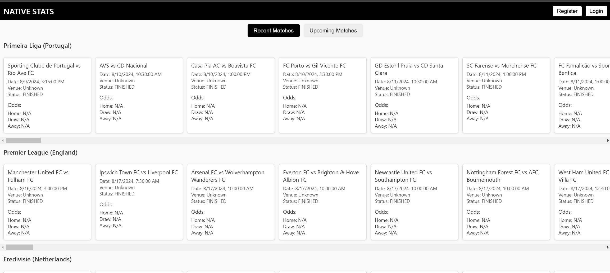

# brightgrove

## Project Setup

```sh
npm install
```

### Compile and Hot-Reload for Development

```sh
npm run dev
```

### Compile and Minify for Production

```sh
npm run build
```

### Page example



### Future improvement

* Deal with rate limiting
* Improve CORS handling
* Better 'loading' so user wont see empty page
* Improve CSS
* Deploy to cloud
* Refresh button / webhook to update finished matches